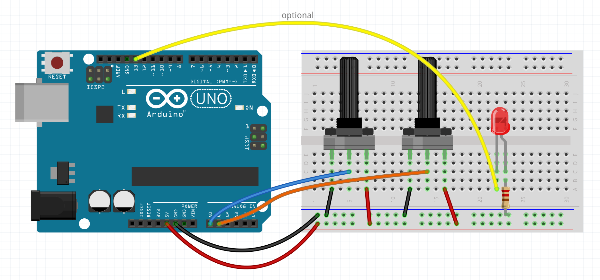

# PWM Visualizer

This is a pair of programs for the Arduino and Processing, to help students
develop an understanding of Pulse Width Modulation (PWM).

The Arduino sketch uses a software to control the onboard (and, optionally, an
external) LED.

The Processing sketch simulates an oscilloscope that displays the current PWM
waveform, using serial data from the Arduino sketch.

## Instructions

Wire an Arduino to a couple of pots, as described in `pwm_explorer.ino`. Upload
`pwm_explorer.ino` to the Arduino. One pot controls the frequency, and the other
controls the duty cycle. They flash the on-board LED. For greater visibility,
connect an external LED to pin 13.

Run `pwm_scope.pde` in Processing. The code attempts to identify the serial
port; if this fails, uncomment and edit line 20. This code shows a simulation of
the waveform, using the actual PWM frequency and duty cycle from a connected
Arduino.

## Related

[PWM Explorer](https://osteele.github.io/pwm-explorer/) is a similar
visualization tool, that runs entirely in simulation in a browser window. (It
does not require a physical connection to an Arduino.)

## License

MIT
